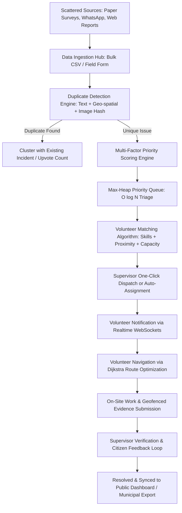

# CivicSync — End-to-End Implementation Roadmap & Architectural Plan
**Smart Resource Allocation & Data-Driven Volunteer Coordination for Social Impact**

---

## 1. Executive Summary & Problem Context

Local social welfare groups, community workers, and NGOs frequently collect vital data regarding community distress—such as potable water shortages, damaged roads, overflowing sanitation points, healthcare deficits, and emergency shelter demands—via **handwritten paper surveys, ground field sheets, WhatsApp messages, and phone calls**. 

Because this information remains scattered across notebooks, spreadsheets, and decentralized messaging threads:
1. **Urgent crises get lost in the noise**, leading to delayed disaster response.
2. **Volunteers are dispatched arbitrarily**, wasting precious travel time and mismatching skills (e.g., dispatching medical volunteers to clear debris while sanitation workers are idle).
3. **Duplicate reports skew triage**, causing multiple teams to visit the same site while nearby wards receive zero assistance.
4. **Lack of verifiable completion proof** weakens accountability and discourages civic donors and municipal agencies.

### Platform Mission
**CivicSync** is an end-to-end, multi-tier civic management platform that ingests fragmented community surveys and citizen reports, eliminates duplicates, dynamically calculates urgency using a **Max-Heap Priority Queue**, smartly matches available volunteers using **multi-criteria optimization & Dijkstra-based routing**, and verifies resolutions using **geofenced proof-of-work**.

---

## 2. Immediate Triage: Resolving the Supabase "Invalid API Key" Error

### 2.1 Why Does This Error Occur on Vercel?
In Vite-based applications (`package.json`), client-side environment variables **must** begin with the `VITE_` prefix and are statically injected during `vite build`.

When testing on `https://civic-sync-mini-project.vercel.app/`:
1. **Missing / Unexposed Vercel Environment Variables**: If `VITE_SUPABASE_URL` and `VITE_SUPABASE_ANON_KEY` are not configured in Vercel's Project Settings, Vite defaults back to the fallback string in `src/lib/supabase.ts`:
   ```typescript
   const supabaseUrl = import.meta.env.VITE_SUPABASE_URL || 'https://demo-placeholder.supabase.co';
   const supabaseAnonKey = import.meta.env.VITE_SUPABASE_ANON_KEY || 'demo-placeholder-anon-key';
   ```
   When the browser attempts to contact Supabase Auth endpoints with `demo-placeholder-anon-key`, Supabase responds with HTTP 401 `{"message":"Invalid API key"}`.
2. **Incorrect Key Type**: Often, developers mistakenly copy the **Database Password**, the **Personal Access Token (`sbp_...`)**, or the **`service_role` (secret)** key instead of the **`anon` / `public` API key**.
3. **Stale Vercel Build**: Changing environment variables in Vercel does not automatically affect previously deployed bundles; a **Redeploy** (without cache) is mandatory.

---

### 2.2 Step-by-Step Fix Procedure

#### Step A: Retrieve Correct Keys from Supabase Dashboard
1. Log into [Supabase Dashboard](https://supabase.com/dashboard).
2. Select your CivicSync project (e.g., `civicsync` or create a new project if not yet created).
3. In the left navigation, click on **Project Settings** (gear icon) ➔ **API**.
4. Locate the following two values:
   - **Project URL**: e.g., `https://abcdefghijklm.supabase.co`
   - **Project API Keys**: Copy the **`anon` / `public`** key (starts with `eyJh...`). *(Do NOT use the `service_role` key in frontend code for security reasons!)*

#### Step B: Apply Database Migrations in Supabase SQL Editor
Open your Supabase dashboard ➔ **SQL Editor** ➔ **New Query**, and execute the migration files located in `supabase/migrations/` in this exact order:
1. `20260922100404_civicsync_schema.sql` (Creates all 20 tables, custom types, RLS, indexes, and automated triggers).
2. `20260922100630_add_accept_task_atomic.sql` (Atomic stored procedure for volunteer task acceptance avoiding race conditions).
3. `20260922103005_create_storage_bucket.sql` (Initializes `report-media` storage bucket).
4. `20260922103738_add_storage_policies.sql` (Grants read/upload permissions for citizen media and evidence).
5. `20260922112000_harden_authentication.sql` (Prevents privilege escalation on registration).
6. `20260922113000_demo_auth_rls_fix.sql` (Permits seamless fallback and verified profile auto-creation).

#### Step C: Configure Local Development (`.env.local`)
Create a file named `.env.local` inside `CivicSync-Shravani/CivicSync-Shravani/`:
```env
VITE_SUPABASE_URL=https://your-project-ref.supabase.co
VITE_SUPABASE_ANON_KEY=eyJhbGciOiJIUzI1NiIsInR5cCI6IkpXVCJ9...
VITE_DEMO_MODE=false
```

#### Step D: Configure Production Environment on Vercel
1. Go to your [Vercel Dashboard](https://vercel.com/) ➔ Select `civic-sync-mini-project`.
2. Navigate to **Settings** ➔ **Environment Variables**.
3. Add the following variables for **Production**, **Preview**, and **Development**:
   - Key: `VITE_SUPABASE_URL` | Value: `https://your-project-ref.supabase.co`
   - Key: `VITE_SUPABASE_ANON_KEY` | Value: `eyJh...` (your anon public key)
   - Key: `VITE_DEMO_MODE` | Value: `false`
4. Go to the **Deployments** tab ➔ Click the three dots on the latest deployment ➔ Select **Redeploy** (ensure "Use existing Build Cache" is **unchecked**).

---

## 3. High-Level Architecture for Scale (Thousands of Users)

To transition from a simple demo to a system serving thousands of citizens, hundreds of field volunteers, and multiple NGOs/municipal departments, we structure CivicSync as a modern, decoupled cloud architecture:

```
[ Citizens & Field Workers ]    [ Volunteers (Mobile PWA) ]     [ NGO Supervisors & Admins ]
           │                                │                                │
           ▼                                ▼                                ▼
  ┌──────────────────────────────────────────────────────────────────────────────┐
  │                           React 18 + Vite Frontend                           │
  │  Tailwind CSS UI ── Leaflet GIS Map ── Offline ServiceWorker Cache (IndexedDB)│
  └──────────────────────────────────────┬───────────────────────────────────────┘
                                         │
                 HTTPS / REST & WebSockets (Realtime Channels)
                                         │
                                         ▼
  ┌──────────────────────────────────────────────────────────────────────────────┐
  │                         Supabase Backend & Edge                              │
  │ ┌───────────────────────────┐  ┌───────────────────────────────────────────┐ │
  │ │ Supabase Auth (JWT / RBAC)│  │ Supabase Realtime (Live Task Push Alerts) │ │
  │ ├───────────────────────────┤  ├───────────────────────────────────────────┤ │
  │ │ Storage: report-media     │  │ Edge Functions: AI Triage & SMS Gateway   │ │
  │ └───────────────────────────┘  └───────────────────────────────────────────┘ │
  │                                      │                                       │
  │                         PostgreSQL 15 Relational DB                          │
  │  • Spatial Queries (PostGIS)              • Max-Heap Indexing               │
  │  • Row-Level Security (Multi-tenant)      • Audit Logs & Verification Triggers│
  └──────────────────────────────────────────────────────────────────────────────┘
```

### 3.1 Four Core Personas & Role-Based Access Control (RBAC)
| Role | Primary Activities | Access Permissions |
| :--- | :--- | :--- |
| **Citizen / Reporter** | Submit single incident, take photo, track status, confirm resolution satisfaction. | Can only view their own reports & public verified incidents. |
| **NGO Field Worker** | Bulk upload paper surveys (CSV/Excel), digitize door-to-door assessments, flag distress clusters. | Can create reports on behalf of communities; view ward analytics. |
| **Volunteer** | Browse matched tasks, accept/decline tasks, view optimal travel route, upload geofenced photo proof. | Can view assigned tasks, update task status, submit resolution evidence. |
| **Supervisor / NGO Admin**| Review duplicates, adjust weights, trigger automated dispatch, verify volunteer evidence, export data. | Full management of reports, tasks, volunteer allocations, and audit logs. |

---

## 4. End-to-End Functional Pipeline



---

## 5. Algorithmic Deep-Dive (Mini-Project USP)

For your Mini-Project presentation, examiners place high value on **concrete algorithmic implementations and mathematical modeling**. CivicSync features three core algorithms:

### 5.1 Multi-Factor Priority Scoring with Dynamic Aging
Rather than simple FIFO (First In, First Out) which causes urgent emergencies to wait, CivicSync computes an objective priority score $P \in [0, 100]$:

$$P = w_s \cdot S + w_u \cdot U + w_a \cdot A + w_t \cdot T(t) + w_v \cdot V$$

Where:
- $S$: Severity score ($[0, 100]$, e.g., Water Contamination = 90, Litter = 25)
- $U$: Urgency score ($[0, 100]$, risk of immediate harm)
- $A$: Population affected score: $\min\left(\frac{\text{affected people}}{100} \times 100, 100\right)$
- $T(t)$: Dynamic time-decay factor (prevents starvation of low-severity tasks):
  $$T(t) = 100 \times \left(1 - e^{-\lambda \cdot t}\right)$$
  *(where $t$ is hours elapsed since submission, ensuring long-pending tasks bubble up).*
- $V$: Ward Vulnerability Index ($[0, 100]$ based on socio-economic and medical access indicators).
- **Data Structure**: Maintained inside a **Binary Max-Heap** (`MaxHeap` in `src/lib/priorityQueue.ts`) providing:
  - Task Insertion: $\mathcal{O}(\log N)$
  - Highest-Priority Extraction (`extractMax`): $\mathcal{O}(\log N)$
  - Heap Construction: $\mathcal{O}(N)$

### 5.2 Multi-Criteria Volunteer Matching Algorithm
Matches the right volunteer to the right task without overloading anyone:

$$\text{MatchScore}(v, t) = 0.35 \cdot S_{\text{skill}} + 0.25 \cdot C_{\text{workload}} + 0.25 \cdot D_{\text{geo}} + 0.15 \cdot R_{\text{rating}}$$

1. **Skill Compatibility ($S_{\text{skill}}$)**:
   $$S_{\text{skill}} = \frac{|\text{VolunteerSkills} \cap \text{TaskSkills}|}{|\text{TaskSkills}|} \times 100$$
2. **Workload Buffer ($C_{\text{workload}}$)**:
   $$C_{\text{workload}} = \left(\frac{\text{MaxCapacity} - \text{ActiveTasks}}{\text{MaxCapacity}}\right) \times 100$$
3. **Geographic Proximity ($D_{\text{geo}}$)**:
   Calculated using Haversine formula over $(lat_1, lon_1)$ and $(lat_2, lon_2)$:
   $$d = 2R \arcsin\left(\sqrt{\sin^2\left(\frac{\Delta \phi}{2}\right) + \cos \phi_1 \cos \phi_2 \sin^2\left(\frac{\Delta \lambda}{2}\right)}\right)$$
   Proximity score decays as distance exceeds $15\text{ km}$.
4. **Reliability Rating ($R_{\text{rating}}$)**:
   Historical volunteer performance rating ($0$ to $5$ stars mapped to $[0, 100]$).

### 5.3 Dijkstra-Based Route Optimization for Field Dispatch
When a volunteer is assigned multiple relief sites in a single day (e.g., medical supply delivery or flood relief packages):
- Models local waypoints as an undirected weighted graph $G = (V, E)$, where edge weights $W(u, v)$ represent road distance / travel time.
- Uses Dijkstra's single-source shortest path algorithm ($\mathcal{O}((V + E)\log V)$) implemented in `src/lib/dijkstra.ts` to output the optimal visiting sequence, minimizing fuel and transit time.

### 5.4 Multi-Tier Duplicate Detection Engine
Prevents duplicate survey entries from fragmenting response teams:
1. **Text Similarity**: Jaccard similarity coefficient on tokenized keywords:
   $$J(A, B) = \frac{|A \cap B|}{|A \cup B|}$$
2. **Spatial Radius**: Clustered within radius $R \le 500\text{ meters}$.
3. **Cryptographic & Perceptual Media Hash**: SHA-256 hash checking against existing `report_media.file_hash` to detect re-uploaded identical photos.

---

## 6. Implementation Roadmap: 6 Step-by-Step Phases

### Phase 1: Authentication & Supabase Infrastructure (Days 1–2)
*Goal: Fix 401 Invalid Key error and establish secure live backend.*
- [x] Run database migrations in Supabase SQL editor (`civicsync_schema.sql` to `demo_auth_rls_fix.sql`).
- [x] Verify Supabase Storage bucket `report-media` is created with public read access.
- [ ] Add `.env.local` with verified `VITE_SUPABASE_URL` and `VITE_SUPABASE_ANON_KEY`.
- [ ] Configure Vercel Project Environment Variables and redeploy without build cache.
- [ ] Test live signup and login with citizen, volunteer, and supervisor test accounts.

### Phase 2: Ingestion & Digitization of Paper Surveys (Days 3–5)
*Goal: Solve the core problem of scattered offline NGO field reports.*
- [ ] **Build CSV/Excel Bulk Survey Importer** in `src/pages/supervisor/`:
  - Allow NGO coordinators to upload survey spreadsheets (columns: Ward, Street, Problem Type, Urgency, Estimated Families Affected, Date).
  - Client-side parser with column-mapping preview.
- [ ] **Batch Duplicate Check**: Run the duplicate detection algorithm across the uploaded spreadsheet before writing to database.
- [ ] **Bulk Ingestion to Supabase**: Insert sanitized records in a single database transaction.

### Phase 3: Smart Resource Allocation & Interactive Dispatch (Days 6–8)
*Goal: Make volunteer matching dynamic, data-driven, and transparent.*
- [ ] Connect `PriorityQueuePage.tsx` with live Supabase database queries (sorting by `priority_score DESC`).
- [ ] Integrate interactive map visualization on `MapDashboardPage.tsx` using Leaflet / OpenStreetMap markers color-coded by priority (Red = Critical, Orange = High, Yellow = Medium).
- [ ] Connect `VolunteerMatchingPage.tsx` to automatically suggest top 3 best-fit volunteers whenever a supervisor clicks "Dispatch".
- [ ] Include visual explanation pills (e.g., *"100% skill match"*, *"1.2 km away"*, *"3 open slots"*).

### Phase 4: Volunteer Mobile Flow & Geofenced Proof-of-Work (Days 9–11)
*Goal: Close the loop between task assignment, physical execution, and evidence.*
- [ ] **Volunteer Task View (`TaskDetailsPage.tsx`)**:
  - Accept / Decline task buttons with automatic workload increment.
  - "Get Route" button displaying the Dijkstra shortest path on an interactive map.
- [ ] **Geofenced Check-In**:
  - Compare volunteer's current GPS coords (`navigator.geolocation`) with task location.
  - Require check-in within $150\text{ m}$ to enable evidence upload.
- [ ] **Before/After Media Upload**:
  - Direct file upload to `report-media` bucket.
  - Store photo URL in `evidence` table.
- [ ] **Supervisor Verification (`EvidenceVerificationPage.tsx`)**:
  - Side-by-side Before vs After photo comparison.
  - One-click "Approve & Mark Resolved" or "Request Re-work".

### Phase 5: Real-time Communication & Civic Analytics (Days 12–13)
*Goal: Enable real-time updates and high-impact administrative reporting.*
- [ ] **Supabase Realtime Subscriptions**:
  - Volunteers receive instant pop-up toast notifications when assigned a new task.
  - Citizen report tracker updates in real-time when status changes from `assigned` ➔ `in_progress` ➔ `resolved`.
- [ ] **NGO / Admin Impact Dashboard (`AnalyticsPage.tsx`)**:
  - KPI Metrics: Average Resolution Time (hours), Total Citizens Impacted, Volunteer Utilization Rate, Top 5 Problematic Wards.
  - CSV / PDF export feature for municipal officials or donor reporting.

### Phase 6: Testing, Polish & Project Presentation Prep (Days 14–15)
*Goal: Deliver a flawless viva demo and mini-project report.*
- [ ] Prepare 4 seeded test accounts for viva demonstration:
  - `admin@civicsync.org`
  - `supervisor@civicsync.org`
  - `volunteer@civicsync.org`
  - `citizen@civicsync.org`
- [ ] Test end-to-end user journey across all roles.
- [ ] Complete technical documentation, UML diagrams, and complexity analysis.

---

## 7. Mini-Project Evaluation & Viva Preparation

When presenting this project to evaluators, highlight the following key technical achievements:

| Evaluation Criterion | How CivicSync Excels |
| :--- | :--- |
| **Problem Relevance** | Targets real-world NGO bottleneck: transition from scattered paper surveys to structured digital dispatch. |
| **Data Structures & Algorithms** | **Binary Max-Heap** for dynamic priority queues; **Dijkstra's Algorithm** for travel optimization; **Haversine formula** for spatial proximity; **Jaccard Tokenization** for duplicate detection. |
| **System Architecture** | Strict **Role-Based Access Control (RBAC)** across 4 distinct roles; **Row Level Security (RLS)** in PostgreSQL protecting citizen privacy. |
| **Scalability & Resilience** | Designed to scale to thousands of users via PostGIS spatial indexing, database connection pooling, and client-side demo fallback mode. |
| **Social Impact & Accountability** | Geofenced before-and-after photographic evidence prevents ghost task completion and ensures genuine civic impact. |

---

*Authored for the CivicSync Mini-Project Team.*
